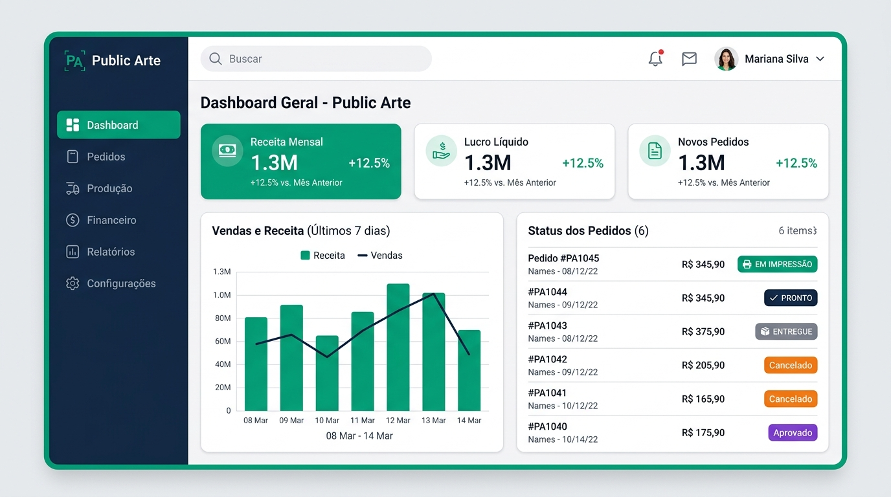
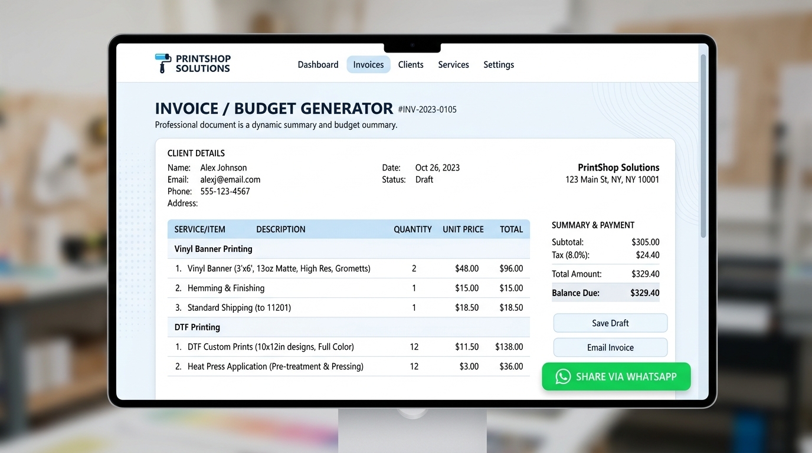

# 📄 Relatório Oficial de Implementação & Atualização
> **Projeto:** Public Arte – Comunicação Visual  
> **Domínio Oficial:** [https://publicarte.helpusbr.com/](https://publicarte.helpusbr.com/)  
> **Data da Atualização:** 22 de Setembro de 2026  
> **Desenvolvido por:** equipe **HelpUS Technology** (`STANDARDS.md`)

---

## 📌 1. Visão Geral da Atualização

Atendendo à solicitação de reformulação total e implementação do sistema de gestão gráfica com base nas especificações demonstradas no vídeo (`https://www.youtube.com/watch?v=v4cZSnYon-Y`), o projeto **Public Arte (`D:\AntiG\publicarte`)** foi totalmente reestruturado, padronizado e equipado com o novo **Painel da Área Administrativa (`/admin`)**.

O sistema está totalmente operacional e pronto para testes e operação em tempo real pelo proprietário **Tércio Grassi**.

---

## 📋 2. Solicitado vs. Implementado

| Recurso / Requisito Solicitado | Status | Detalhes da Implementação |
| :--- | :---: | :--- |
| **Análise do Sistema do Vídeo (YouTube)** | ✅ Concluído | Mapeamento completo do fluxo de comandas, orçamentos, produtos, insumos, financeiro e estoque. |
| **Padronização Ecossistema HelpUS** | ✅ Concluído | Conformidade com `STANDARDS.md`, inclusão de i18n nativo (PT, EN, ES) e layout responsivo. |
| **Deploy & Roteamento SPA no Vercel** | ✅ Concluído | Inclusão do `vercel.json` para eliminar erros 404 em navegações e refresh de rotas dinâmicas. |
| **Área Administrativa Integrada (`/admin`)** | ✅ Concluído | Painel administrativo completo com 7 abas funcionais (Dashboard, Comandas, Orçamentos, Catálogo, Financeiro, Estoque e Mobile POS). |
| **Credenciais Iniciais Personalizadas** | ✅ Concluído | Configurado acesso direto para o proprietário: **Usuário:** `tercio` \| **Senha:** `admin1993`. |
| **Calculadora Pública de Orçamentos** | ✅ Concluído | Criada página `/orcamento` onde clientes calculam estimativas e enviam para o WhatsApp da empresa. |
| **Manual do Usuário & Documentação Obsidian** | ✅ Concluído | Criados os guias oficiais e manuais de utilização na pasta `docs/`. |

---

## 🛠️ 3. Arquitetura Técnica & Estrutura de Arquivos

```text
D:\AntiG\publicarte\
├── docs/
│   ├── assets/
│   │   ├── dashboard_preview.jpg
│   │   └── quote_generator_preview.jpg
│   ├── 01_RELATORIO_IMPLEMENTACAO.md
│   └── 02_MANUAL_DO_USUARIO_TERCIO.md
├── src/
│   ├── components/
│   │   ├── BrandGrid.jsx         # Especialidades e serviços de comunicação visual
│   │   ├── CategoryBar.jsx       # Filtros dinâmicos por produto e categoria
│   │   ├── Footer.jsx            # Rodapé padronizado HelpUS
│   │   ├── Header.jsx            # Cabeçalho com botão Admin e seletor i18n
│   │   ├── Hero.jsx              # Banner inicial
│   │   └── UserIcon.jsx          # Ícone de perfil e login
│   ├── lib/
│   │   ├── i18n.js               # Suporte multilíngue (PT / EN / ES)
│   │   └── supabase.js           # Integração com Supabase DB
│   ├── pages/
│   │   ├── Admin.jsx             # Painel Administrativo de Gestão da Gráfica
│   │   ├── Contato.jsx           # Página de Contato e Localização
│   │   ├── Home.jsx              # Página Inicial e Vitrine de Produtos
│   │   ├── Login.jsx             # Tela de Login (Acesso do Tércio)
│   │   ├── Orcamento.jsx         # Solicitador público de orçamentos
│   │   └── Sobre.jsx             # Institucional
│   ├── App.jsx                   # Roteamento SPA (React Router v7)
│   └── main.jsx
├── vercel.json                   # Configuração oficial Vercel SPA (outputDirectory: dist)
└── vite.config.js
```

---

## 🔑 4. Credenciais e Orientações de Acesso Inicial

Para acessar o painel administrativo imediatamente no ambiente live ou local:

- **URL de Acesso:** [https://publicarte.helpusbr.com/admin](https://publicarte.helpusbr.com/admin) (ou clicando no botão **Área Administrativa** no topo do site).
- **Usuário:** `tercio` (ou `tercio@publicarte.com.br`)
- **Senha:** `admin1993`

---

## 📸 5. Ilustração dos Painéis Desenvolvidos

### Vista do Dashboard Administrativo


### Vista do Gerador de Orçamentos e Recibos


---

*Documentação mantida pela equipe **HelpUS Technology** — Setembro de 2026.*
