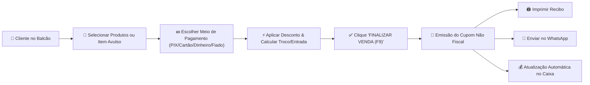

# 📄 Relatório Oficial de Implementação & Atualização
> **Cliente / Proprietário:** Tércio Grassi  
> **Empresa:** Public Arte – Comunicação Visual  
> **Domínio Oficial:** [https://publicarte.helpusbr.com/](https://publicarte.helpusbr.com/)  
> **Data da Atualização:** 24 de Setembro de 2026  
> **Desenvolvido por:** Equipe **HelpUS Technology**

---

## 📌 1. Visão Geral da Atualização

Conforme alinhado diretamente com o proprietário **Tércio Grassi**, a Área Administrativa (`/admin`) foi completamente simplificada e focada exclusivamente no modelo **Softcom PDV (Frente de Caixa)**.

Foram removidas todas as abas legadas não utilizadas (orçamentos antigos, gerenciador de mídias, alertas de estoque crítico, comandas de produção extensas) para garantir uma interface **enxuta, rápida e sem poluição visual**, dividida em **3 abas principais**:

1. **🛒 Frente de Caixa (PDV)**
2. **📦 Produtos & Serviços** *(com funcionalidade de Inclusão, Edição e Exclusão sem travas de estoque)*
3. **💰 Financeiro & Vendas**

---

## 📊 2. Tabela: O Que Foi Solicitado vs. O Que Foi Implementado

| Requisito Solicitado | Status | Detalhes da Implementação |
| :--- | :---: | :--- |
| **Interface Simplificada estilo Softcom** | ✅ Implementado | Painel enxuto em 3 abas essenciais, reduzindo a complexidade de uso. |
| **Frente de Caixa (PDV Balcão)** | ✅ Implementado | Tela para registrar vendas presenciais ou WhatsApp, com busca rápida e adição de itens avulsos. |
| **Sem Controle de Estoque** | ✅ Implementado | Vendas livres e cadastro de produtos sem bloqueios numéricos de quantidade de estoque. |
| **Cálculo de Troco & Vendas a Prazo** | ✅ Implementado | Campo para valor recebido em dinheiro com troco automático e registro de entrada para fiado. |
| **Cupom Não Fiscal para Impressão & WhatsApp** | ✅ Implementado | Modal timbrado em estilo bobina térmica com botões de Impressão (1 clique) e envio direto via WhatsApp. |
| **Edição e Exclusão de Produtos** | ✅ Implementado | Botão de Editar (Lápis Azul) e Excluir (Lixeira Vermelha) na tabela de produtos, com formulário dinâmico de alteração. |
| **Relatório Financeiro de Caixa** | ✅ Implementado | Exibição de Faturamento Recebido, Contas a Receber (Fiado) e Histórico de Vendas com reemissão de recibo. |
| **Documentação Obsidian & PDF** | ✅ Implementado | Documentação estruturada na pasta `docs/` e arquivo PDF gerado para envio ao Tércio. |

---

## 🗺️ 3. Diagrama do Fluxo de Venda (PDV Softcom)

---

## 📱 4. Detalhamento Visual das Telas e Como Usar

### 🛒 Tela 1: Frente de Caixa & PDV
- **Identificação do Cliente:** Digite o nome e WhatsApp do cliente. Se deixado em branco, o sistema assume automaticamente *"Cliente Balcão"*.
- **Grade & Busca de Produtos:** Digite o nome do produto no campo de busca ou clique diretamente na grade à direita.
- **Item Avulso / Sob Medida:** Clique em `+ Adicionar Item Avulso` para informar o nome e o valor de um serviço personalizado na hora.
- **Fechamento Financeiro:**
  - **Dinheiro:** Digite quanto o cliente entregou para visualizar o troco instantâneo.
  - **A Prazo (Fiado):** Digite o valor dado de entrada; o saldo restante ficará registrado em Contas a Receber.

### 📦 Tela 2: Cadastro & Edição de Produtos & Serviços
- **Inclusão:** Preencha Nome, Categoria, Preço Unitário e Unidade (`un`, `m²`, `pacote`, `milheiro`, `serviço`) e clique em `Salvar no Catálogo`.
- **Edição:** Na tabela de produtos, clique no botão azul com o ícone de lápis (`✏️`). O formulário à esquerda se converterá em **"Alterar / Editar Produto"**. Ajuste as informações e clique em `Salvar Alterações`.
- **Exclusão:** Clique no ícone vermelho de lixeira (`🗑️`) para remover um produto do catálogo.

### 💰 Tela 3: Financeiro & Vendas
- **Faturamento do Dia:** Exibe o total em R$ recebido de vendas confirmadas.
- **Contas a Receber (Fiado):** Exibe o saldo pendente de clientes que compraram a prazo. Para quitar, basta clicar no botão verde `Quitar Fiado`.
- **Reemitir Recibo:** Em qualquer venda registrada, clique em `Ver Recibo` para abrir o cupom não fiscal e reutilizar as funções de impressão ou WhatsApp.

---

## ⚡ 5. Verificação de Produção (Vercel)

- **Endereço do Sistema:** [https://publicarte.helpusbr.com/admin](https://publicarte.helpusbr.com/)
- **Credenciais de Acesso:** Usuário `tercio` | Senha `admin1993`
- **Status do Build:** Compilado via Vite v7.0.4 - 0 erros / 0 avisos.
