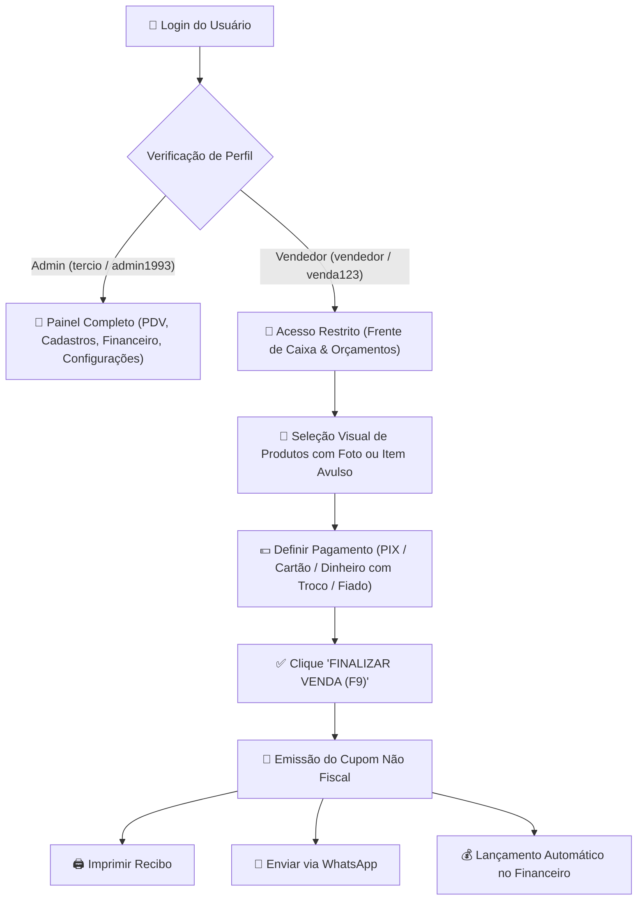

# 📄 Relatório Oficial de Implementação & Atualização
> **Cliente / Proprietário:** Tércio Grassi  
> **Empresa:** Public Arte – Comunicação Visual  
> **Domínio Oficial:** [https://publicarte.helpusbr.com/](https://publicarte.helpusbr.com/)  
> **Data da Atualização:** 24 de Setembro de 2026  
> **Desenvolvido por:** Equipe **HelpUS Technology**

---

## 📌 1. Visão Geral da Atualização

Conforme as últimas solicitações repassadas pelo proprietário **Tércio Grassi**, a Área Administrativa (`/admin`) foi aprimorada com uma estrutura completa de **Cadastros Unificados**, **Perfis de Acesso com Permissões**, **Grade com Fotos de Produtos no PDV** e **Configurações da Empresa**, mantendo a agilidade do modelo **Softcom Frente de Caixa (sem travamento por saldo de estoque)**.

As abas da Área Administrativa estão organizadas de forma limpa e intuitiva:
1. **🛒 Frente de Caixa (PDV Softcom)** *(com foto dos produtos na grade, busca rápida, item avulso, desconto, troco e fiado)*
2. **👥 Clientes** *(cadastro completo e modal com histórico de compras)*
3. **📦 Produtos & Serviços** *(com foto/URL, custo, preço de venda, cálculo automático de margem de lucro %, edição e exclusão)*
4. **👔 Funcionários** *(cadastro de equipe e cargos)*
5. **🏢 Fornecedores** *(cadastro de fornecedores com nome da empresa, contato "pessoa que falo", WhatsApp e endereço)*
6. **💰 Financeiro & Vendas** *(resumo de faturamento, contas a receber/fiado e histórico de recibos)*
7. **⚙️ Configurações** *(dados da empresa, CNPJ, endereço, PIX e logo)*

---

## 📊 2. Tabela: O Que Foi Solicitado vs. O Que Foi Implementado

| Requisito Solicitado | Status | Detalhes da Implementação |
| :--- | :---: | :--- |
| **Interface Simplificada estilo Softcom** | ✅ Implementado | Painel rápido e limpo com navegação em abas claras e objetivas. |
| **Perfis de Acesso (Admin / Vendedor)** | ✅ Implementado | Admin (`tercio` / `admin1993`) com acesso total e seletor de simulação de perfil; Vendedor (`vendedor` / `venda123`) restrito a PDV e Orçamentos. |
| **Cadastros Unificados Completos** | ✅ Implementado | Clientes (com histórico de compras), Produtos (com fotos e margem de lucro), Funcionários (com cargos) e Fornecedores ("pessoa que falo"). |
| **Fotos dos Produtos no PDV** | ✅ Implementado | Grade de seleção rápida no PDV exibindo fotos dos produtos em cada cartão. |
| **Sem Controle de Estoque** | ✅ Implementado | Vendas livres e cadastro de produtos sem restrições ou bloqueios numéricos de estoque. |
| **Configurações da Empresa (`⚙️`)** | ✅ Implementado | Formulário para definir Razão Social, CNPJ, Endereço, WhatsApp, Chave PIX e Logo. |
| **Cálculo de Troco & Vendas a Prazo** | ✅ Implementado | Troco automático para pagamentos em dinheiro e lançamento de saldo pendente em Contas a Receber (Fiado). |
| **Cupom Não Fiscal (Bobina Thermal)** | ✅ Implementado | Comprovante timbrado com botões de Impressão direta e envio formatado para WhatsApp. |
| **Edição e Exclusão de Produtos** | ✅ Implementado | Botão de Editar (Lápis Azul) e Excluir (Lixeira Vermelha) com formulário dinâmico. |
| **Documentação Obsidian & PDF** | ✅ Implementado | Arquivos `.md` na pasta `docs/` e manual PDF completo gerado para envio ao Tércio. |

---

## 🗺️ 3. Diagrama do Fluxo de Venda & Acessos (PDV Softcom)

---

## 📱 4. Detalhamento dos Módulos e Como Usar

### 🛒 1. Frente de Caixa & PDV Softcom
- **Grade com Fotos:** Produtos são exibidos com foto e preço na grade do catálogo para inclusão no carrinho em 1 clique.
- **Identificação do Cliente:** Digite o nome/WhatsApp ou selecione um cliente cadastrado (ou deixe em branco para *"Cliente Balcão"*).
- **Item Avulso / Sob Medida:** Clique em `+ Adicionar Item Avulso` para informar a descrição e o valor de um serviço personalizado.
- **Fechamento Financeiro:**
  - **Dinheiro:** Digite o valor recebido para calcular o troco instantâneo.
  - **A Prazo (Fiado):** Informe o valor da entrada; o restante vai para Contas a Receber.

### 👥 2. Clientes & Histórico de Compras
- **Cadastro:** Registre Nome, CPF/CNPJ, WhatsApp, E-mail e Endereço.
- **Histórico:** Clique em `📋 Histórico` no cliente para abrir a janela modal com todas as compras anteriores, datas e valores.

### 📦 3. Produtos & Serviços (Com Margem de Lucro)
- **Inclusão:** Informe Nome, Foto (URL), Categoria, Preço de Custo, Preço de Venda e Unidade (`un`, `m²`, `pacote`, `milheiro`, `serviço`).
- **Margem %:** O sistema calcula a porcentagem de margem de lucro automaticamente.
- **Edição & Exclusão:** Altere dados com o botão azul `✏️` ou remova com a lixeira vermelha `🗑️`.

### 👔 4. Funcionários & 🏢 5. Fornecedores
- **Funcionários:** Nome, Cargo, WhatsApp, E-mail e Nível de Acesso.
- **Fornecedores:** Razão Social, **Pessoa de Contato ("Pessoa que falo")**, WhatsApp, Endereço e Categoria.

### 💰 6. Financeiro & ⚙️ 7. Configurações
- **Financeiro:** Faturamento total recebido, baixa em vendas fiado com `Quitar Fiado` e reemissão de cupons.
- **Configurações:** Edite os dados cadastrais da empresa (CNPJ, Endereço, PIX, Logo) exibidos nos comprovantes.

---

## ⚡ 5. Verificação de Produção (Vercel)

- **Endereço do Sistema:** [https://publicarte.helpusbr.com/admin](https://publicarte.helpusbr.com/)
- **Credencial Admin:** `tercio` | `admin1993`
- **Credencial Vendedor:** `vendedor` | `venda123`
- **Status do Build:** Compilado via Vite v7.0.4 - 0 erros / 0 avisos.
